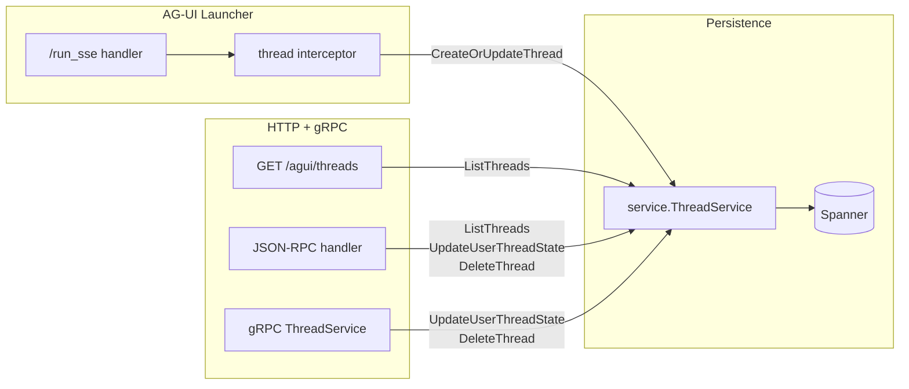

# AG-UI History Go SDK

[](LICENSE)

A Go library for managing AG-UI conversation thread metadata, backed by Google Cloud Spanner.

This library stores **thread-level metadata only** (display names, agent identity, run counts, per-user read/pin state). Conversation events (messages, tool calls) are **not** stored here; ADK sessions are the source of truth for conversation history, served via the AG-UI launcher's `GET /threads/{threadId}/messages` endpoint.

## Packages

| Package | Role |
| --- | --- |
| [`go.alis.build/agui/history/service`](service/) | [`ThreadService`](service/thread.go) — Spanner + IAM implementation for thread metadata and per-user state. |
| [`go.alis.build/agui/history/jsonrpc`](jsonrpc/) | [`NewJSONRPCHandler`](jsonrpc/jsonrpc.go) — JSON-RPC 2.0 HTTP handler for thread operations (list, get, delete, mark-read, pin). |

## Features

- **Thread metadata management:** Display names (auto-generated via Gemini), agent identity, run counts, activity timestamps.
- **Per-user state:** Unread tracking (`run_count` / `read_run_count`), pinning, read timestamps.
- **IAM authorization:** Per-thread IAM policies control access (viewer, owner roles).
- **AG-UI launcher integration:** Wire into the AG-UI launcher via `WithThreadService` so threads are created automatically on each `/run_sse` request.
- **JSON-RPC 2.0 API:** HTTP handler for thread operations (list, get, delete, mark-read, pin) with CORS support.

## Installation

```bash
go get -u go.alis.build/agui/history
```

## Getting Started

### Thread service

Use the built-in Spanner-backed `ThreadService`:

```go
import "go.alis.build/agui/history/service"

threadService, err := service.NewThreadService(ctx, &service.SpannerStoreConfig{
    Project:               "my-project",
    Instance:              "my-instance",
    Database:              "my-database",
    ThreadsTable:          "my_prefix_Threads",
    UserThreadStatesTable: "my_prefix_UserThreadStates",
})
```

Register on a gRPC server for mutations (mark-read, pin, delete). Install
`go.alis.build/iam/v3` interceptors so caller identity is available to
`ThreadService`:

```go
import auth "go.alis.build/iam/v3"

grpcServer := grpc.NewServer(
    grpc.UnaryInterceptor(auth.UnaryInterceptor),
    grpc.StreamInterceptor(auth.StreamInterceptor),
)
threadService.Register(grpcServer)
```

### AG-UI launcher integration

Wire the thread service into the AG-UI launcher so threads are created automatically:

```go
import (
    "go.alis.build/adk/launchers/agui"
    "go.alis.build/adk/launchers/web"
    "go.alis.build/agui/history/service"
)

launcher := web.NewLauncher(
    agui.NewLauncher("my-agent",
        agui.WithThreadService(threadService),
    ),
)
```

This enables:
- `GET /agui/threads` — lists threads with unread/pinned state for the authenticated user
- Automatic thread creation/update on each `/run_sse` request

### JSON-RPC handler (optional)

Expose thread operations over HTTP with JSON-RPC 2.0:

```go
import "go.alis.build/agui/history/jsonrpc"

mux.Handle(jsonrpc.JSONRPCPath, jsonrpc.NewJSONRPCHandler(threadService))
```

With a method-aware mux (Go 1.22+):

```go
jsonrpc.Register(mux, threadService)
```

For browser clients, enable CORS:

```go
jsonrpc.Register(mux, threadService, jsonrpc.WithCORS())
```

Supported methods: `ListThreads`, `GetThread`, `DeleteThread`, `GetUserThreadState`, `UpdateUserThreadState`.

### Display name configuration

Thread display names are generated via Gemini on first creation. Configure the model and location:

```go
threadService, err := service.NewThreadService(ctx, &service.SpannerStoreConfig{
    // ... Spanner config ...
},
    service.WithTitleModel("gemini-2.5-flash-lite"),   // default
    service.WithTitleLocation("global"),               // default
)
```

## Storage

Two Spanner tables (names are configurable via `SpannerStoreConfig`):

| Table | Key | Contents |
| --- | --- | --- |
| Threads | `threads/{thread_id}` | Thread proto + IAM Policy proto |
| UserThreadStates | `threads/{thread_id}/userStates/{user_id}` | UserThreadState proto |

### IAM Roles

Each thread carries its own IAM policy. Roles are defined in the
[`service/roles`](service/roles/) package:

| Role | Permissions | Granted to |
| --- | --- | --- |
| `roles/open` | ListThreads | All authenticated callers (open role) |
| `roles/thread.viewer` | GetThread, GetUserThreadState, UpdateUserThreadState | Users bound in the thread's IAM policy |
| `roles/thread.owner` | All viewer permissions + DeleteThread | Thread creator (auto-granted on first run) |

On thread creation the caller is automatically granted `roles/thread.owner`.

### Authorization

`ListThreads` applies two layers of access control:

1. **SQL member prefilter** — Spanner only returns rows where the caller
   appears in at least one policy binding (matching `user:`, `email:`,
   `domain:`, and `group:` member formats). Privileged identities
   (system/admin) bypass the filter and see all threads.
2. **Per-row check** — each returned row is verified with
   `HasPermission(GetThread, policy)` as defense-in-depth.

All other RPCs (GetThread, DeleteThread, etc.) read the thread's IAM policy
and check the caller's permission directly.

### Pagination

`ListThreads` uses **cursor-based pagination** keyed on
`(last_activity_time DESC, thread_name DESC)`. Page tokens are opaque strings;
pass them as `page_token` in subsequent requests. The first request should
omit `page_token` (or pass an empty string).

### Identity propagation

`ThreadService` requires a caller identity in the request context. There are
three supported propagation paths:

| Transport | How identity arrives |
| --- | --- |
| gRPC | `iam/v3` interceptors (`UnaryInterceptor`, `StreamInterceptor`) extract the identity from request metadata. |
| JSON-RPC (HTTP) | `NewJSONRPCHandler` calls `iam.FromHeader` to parse the `x-alis-identity` header and stores it in the context. |
| In-process | The AG-UI launcher injects the identity via `iam.Identity.Context(ctx)` or `x-alis-identity` gRPC metadata. |

## Architecture



1. **Write path:** The launcher's built-in interceptor calls `CreateOrUpdateThread` on each `/run_sse` request — creating the thread on first run (with Gemini-generated display name) and incrementing `run_count` on subsequent runs.
2. **Read path:** `GET /agui/threads` calls `ListThreads`, which returns caller-scoped `ThreadView` projections joining `Thread` rows with per-user `UserThreadState` rows to compute `has_unread`.
3. **Mutations:** Mark-read, pin, and delete operations go through the gRPC `ThreadService` or the JSON-RPC handler.

## Documentation

- [`service/docs.go`](service/docs.go) — IAM roles, code flow, storage layout.
- Proto definitions: `alis/agui/history/v1` in [`go.alis.build/common`](https://pkg.go.dev/go.alis.build/common/alis/agui/history/v1).
