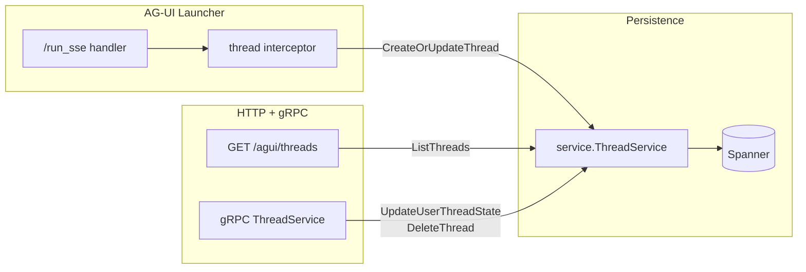

# AG-UI History Go SDK

[](LICENSE)

A Go library for managing AG-UI conversation thread metadata, backed by Google Cloud Spanner.

This library stores **thread-level metadata only** (display names, agent identity, run counts, per-user read/pin state). Conversation events (messages, tool calls) are **not** stored here; ADK sessions are the source of truth for conversation history, served via the AG-UI launcher's `GET /threads/{threadId}/messages` endpoint.

## Packages

| Package | Role |
| --- | --- |
| [`go.alis.build/agui/history/service`](service/) | [`ThreadService`](service/thread.go) — Spanner + IAM implementation for thread metadata and per-user state. |

## Features

- **Thread metadata management:** Display names (auto-generated via Gemini), agent identity, run counts, activity timestamps.
- **Per-user state:** Unread tracking (`run_count` / `read_run_count`), pinning, read timestamps.
- **IAM authorization:** Per-thread IAM policies control access (viewer, admin roles).
- **AG-UI launcher integration:** Wire into the AG-UI launcher via `WithThreadService` so threads are created automatically on each `/run_sse` request.

## Installation

```bash
go get -u go.alis.build/agui/history
```

## Getting Started

### Thread service

Use the built-in Spanner-backed `ThreadService`:

```go
import "go.alis.build/agui/history/service"

threadService, err := service.NewThreadService(ctx, &service.SpannerStoreConfig{
    Project:               "my-project",
    Instance:              "my-instance",
    Database:              "my-database",
    ThreadsTable:          "my_prefix_Threads",
    UserThreadStatesTable: "my_prefix_UserThreadStates",
})
```

Register on a gRPC server for mutations (mark-read, pin, delete):

```go
grpcServer := grpc.NewServer()
threadService.Register(grpcServer)
```

### AG-UI launcher integration

Wire the thread service into the AG-UI launcher so threads are created automatically:

```go
import (
    "go.alis.build/adk/launchers/agui"
    "go.alis.build/adk/launchers/web"
    "go.alis.build/agui/history/service"
)

launcher := web.NewLauncher(
    agui.NewLauncher("my-agent",
        agui.WithThreadService(threadService),
    ),
)
```

This enables:
- `GET /agui/threads` — lists threads with unread/pinned state for the authenticated user
- Automatic thread creation/update on each `/run_sse` request

### Display name configuration

Thread display names are generated via Gemini on first creation. Configure the model and location:

```go
threadService, err := service.NewThreadService(ctx, &service.SpannerStoreConfig{
    // ... Spanner config ...
    TitleModel:    "gemini-2.5-flash-lite", // default
    TitleLocation: "global",               // default
})
```

## Storage

Two Spanner tables:

| Table | Key | Contents |
| --- | --- | --- |
| Threads | `threads/{thread_id}` | Thread proto + IAM Policy |
| UserThreadStates | `threads/{thread_id}/userStates/{user_id}` | UserThreadState proto |

### IAM Roles

| Role | Permissions |
| --- | --- |
| `roles/open` | ListThreads, GetUserThreadState, UpdateUserThreadState |
| `roles/thread.viewer` | GetThread |
| `roles/thread.admin` | GetThread, DeleteThread |

On thread creation, the caller is granted `roles/thread.admin`.

## Architecture



1. **Write path:** The launcher's built-in interceptor calls `CreateOrUpdateThread` on each `/run_sse` request — creating the thread on first run (with Gemini-generated display name) and incrementing `run_count` on subsequent runs.
2. **Read path:** `GET /agui/threads` calls `ListThreads`, which returns caller-scoped `ThreadView` projections joining `Thread` rows with per-user `UserThreadState` rows to compute `has_unread`.
3. **Mutations:** Mark-read, pin, and delete operations go through the gRPC `ThreadService`.

## Documentation

- [`service/docs.go`](service/docs.go) — IAM roles, code flow, storage layout.
- Proto definitions: `alis/agui/history/v1` in [`go.alis.build/common`](https://pkg.go.dev/go.alis.build/common/alis/agui/history/v1).
